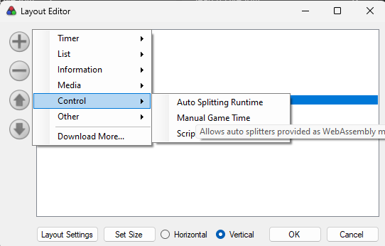
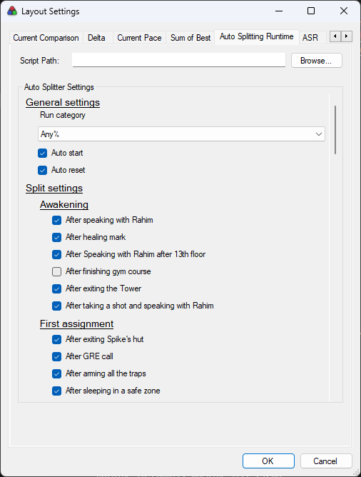
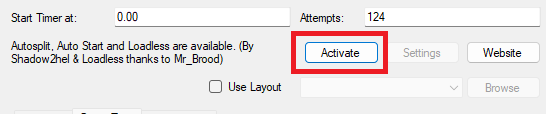
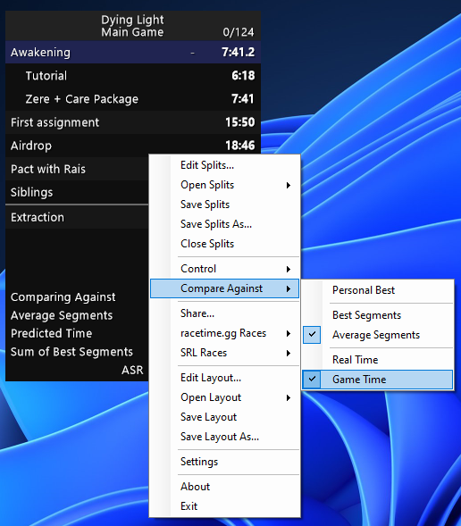

# Autosplitter for Dying Light

An auto splitter and load remover for Dying Light.

## Usage

1. Download latest version of [dl_autosplitter.wasm](https://github.com/mltIronBee/dying-light-autosplitter/releases/download/latest/dl_autosplitter.wasm) from the [Releases page](https://github.com/mltIronBee/dying-light-autosplitter/releases/tag/latest).
2. Open LiveSplit and open `Edit layout window`. Add a new component called `Auto Splitting Runtime` under `Control` tab



, then double click `Auto Splitting Runtime` row in Layout Editor.
3. In the `Auto Splitter Settings`, open `dl_autosplitter.wasm`, then using settings menu, configure your auto splitting settings up to your preferences.



4. Make sure, that default auto splitter, that is downloaded automatically for Dying Light is disabled, by navigating into a `Edit Splits` menu, and deactivating default load remover. This version of autosplitter provides the same load remover functionality.



5. Make sure, that your Live Split is set to `Game Time`



Optionally, you can use precofigured [splits](splits/Dying%20Light%20-%20Autosplitter%20-%20Simple.lss) and [layout](splits/dl_autosplitter_simple.lsl) to run with this auto splitter. Just load the `dl_autosplitter.wasm` and you're ready to go. 

## Compilation

This auto splitter is written in Rust. In order to compile it, you need to
install the Rust compiler: [Install Rust](https://www.rust-lang.org/tools/install).

Afterwards install the WebAssembly target:
```sh
rustup target add wasm32-wasi --toolchain stable
```

The auto splitter can now be compiled:
```sh
cargo b --release
```

The auto splitter is then available at:
```
target/wasm32-wasi/release/dl_autosplitter.wasm
```

Make sure to look into the [API documentation](https://livesplit.org/asr/asr/) for the `asr` crate.

## Development

You can use the [debugger](https://github.com/LiveSplit/asr-debugger) while
developing the auto splitter to more easily see the log messages, statistics,
dump memory, step through the code and more.

The repository comes with preconfigured Visual Studio Code tasks. During
development it is recommended to use the `Debug Auto Splitter` launch action to
run the `asr-debugger`. You need to install the `CodeLLDB` extension to run it.

You can then use the `Build Auto Splitter (Debug)` task to manually build the
auto splitter. This will automatically hot reload the auto splitter in the
`asr-debugger`.

Alternatively you can install the [`cargo
watch`](https://github.com/watchexec/cargo-watch?tab=readme-ov-file#install)
subcommand and run the `Watch Auto Splitter` task for it to automatically build
when you save your changes.

The debugger is able to step through the code. You can set breakpoints in VSCode
and it should stop there when the breakpoint is hit. Inspecting variables may
not work all the time.

## Notes about quests

Detailed information about quests structure and behaviour can be found within data0.pak file. Each quest has an id, which can be found in `data0.pak/data/quests/_patch/patch7_current.scr`.

List of main story quests: 
```
0 - game root
20 - Prologue / speak with Rahim
39 - Heal mark
40 - Speak with Rahim after 13th floor
41 - Finish gym
83 - Exit tower
99 - When dialogue with Rahim ends (after speaking to Zere)
100 - Exit Spike's hut
102 - Speak with GRE
103 - Arm all the traps
104 - Sleep in safe zone
107 - Contact GRE 2
118 - Mother's day quest taken
124 - First airdrop
130 - Second airdrop
158 - Back to Tower
159 - Speak with Breken
162 - Got out of tower (Save warped to Holy year tunnel)
164 - Entered Rais' garrison
165 - Spoke to Karim
193 - First antenna tower
194 - Second antenna tower
195 - Allo, Kyle Crane?
196 - Get to Karim
197 - Speak to Karim
236 - Jaffar's Wheelstation
237 - Fishermen village
266 - Ferry
296 - Envelope
297 - Talk to Rais
428 - Contact GRE 3 & Warp to tower
430 - Jade cutscene
432 - Talk to Breken
433 - Skip Jade call / Take "Good night Mr. Bahir quest"
435 - Got to school
442 - Got to the crate
443 - Killed bandits
444 - Exit school / Skip cutscene
451 - Speak to Zere
483 - Get to the Bolter spawn
485 - Rahim called
499 - Reach Trainyard
502 - Escaped volatile's nest
512 - Rahim is dead
513 - Speak to Breken and Jade
515 - Zere is captured
518 - Reached Rais' garrison
519 - Enter Arena
521 - Arena fight
523 - Reach arena exit
524 - Zere is dead
525 - Talk to Spike
527 - Take stuff back
530 - Reach tunnel
534 - Reach saviours
535 - Talk to guide
539 - Escape ambush
545 - Reach exit
570 - Reach old town
634 - Reach Embers
684 - Enter university
694 - Talked to fidan
729 - Back to embers
730 - Reach sewers entrance
736 - Pick up explosives
743 - Reach 10th floor
754 - Planted all bombs
757 - Picked up the detonator
758 - Reached sewers exit
759 - After explosion cutscene
761 - Rendezvous
762 - Met Tariq
763 - Reach Museum entrance
765 - Fight off the zombies
782 - Dream maze
783 - Dream end
784 - Exit museum
786 - Speak with Troy
787 - Broadcast is warpable
800 - Exit sewers
801 - Finish broadcast
811 - Re-entered broadcast sewers
813 - Dudes spawned
815 - Entered clinic
825 - Speak to Camden
826 - Speak to GRE
828 - Reach finale
829 - Drop down to the sewers
830 - Out of the sewers
831 - Enter arena
832 - ?
833 - Climbed up after crane destruction
834 - Roll credits
```
